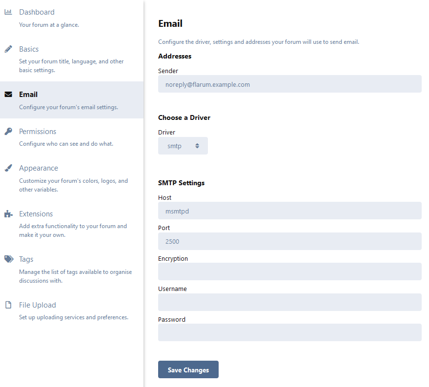

<p align="center"><a href="https://github.com/crazy-max/docker-flarum" target="_blank"></a></p>

<p align="center">
  <a href="https://hub.docker.com/r/crazymax/flarum/tags?page=1&ordering=last_updated"></a>
  <a href="https://github.com/crazy-max/docker-flarum/actions?workflow=build"></a>
  <a href="https://hub.docker.com/r/crazymax/flarum/"></a>
  <a href="https://hub.docker.com/r/crazymax/flarum/"></a>
  <br /><a href="https://github.com/sponsors/crazy-max"></a>
  <a href="https://www.paypal.me/crazyws"></a>
</p>

## About

[Flarum](https://flarum.org/) Docker image based on Alpine Linux.<br />
If you are interested, [check out](https://hub.docker.com/r/crazymax/) my other Docker images!

💡 Want to be notified of new releases? Check out 🔔 [Diun (Docker Image Update Notifier)](https://github.com/crazy-max/diun) project!

___

* [Features](#features)
* [Build locally](#build-locally)
* [Image](#image)
* [Environment variables](#environment-variables)
  * [General](#general)
  * [Flarum](#flarum)
  * [Database](#database)
* [Volumes](#volumes)
* [Ports](#ports)
* [Usage](#usage)
  * [Docker Compose](#docker-compose)
  * [Command line](#command-line)
* [Upgrade](#upgrade)
* [Notes](#notes)
  * [First launch](#first-launch)
  * [Manage extensions](#manage-extensions)
  * [Sending mails with SMTP](#sending-mails-with-smtp)
* [How can I help?](#how-can-i-help)
* [License](#license)

## Features

* Run as non-root user
* Multi-platform image
* [s6-overlay](https://github.com/just-containers/s6-overlay/) as process supervisor
* [msmtpd SMTP relay](https://github.com/crazy-max/docker-msmtpd) image to send emails
* [Traefik](https://github.com/containous/traefik-library-image) as reverse proxy and creation/renewal of Let's Encrypt certificates (see [this template](examples/traefik))

## Build locally

```shell
git clone https://github.com/crazy-max/docker-flarum.git
cd docker-flarum

# Build image and output to docker (default)
docker buildx bake

# Build multi-platform image
docker buildx bake image-all
```

## Image

| Registry                                                                                         | Image                           |
|--------------------------------------------------------------------------------------------------|---------------------------------|
| [Docker Hub](https://hub.docker.com/r/crazymax/flarum/)                                            | `crazymax/flarum`                 |
| [GitHub Container Registry](https://github.com/users/crazy-max/packages/container/package/flarum)  | `ghcr.io/crazy-max/flarum`        |

Following platforms for this image are available:

```
$ docker run --rm mplatform/mquery crazymax/flarum:latest
Image: crazymax/flarum:latest
 * Manifest List: Yes
 * Supported platforms:
   - linux/amd64
   - linux/arm/v6
   - linux/arm/v7
   - linux/arm64
   - linux/386
   - linux/ppc64le
   - linux/s390x
```

## Environment variables

### General

* `TZ`: The timezone assigned to the container (default `UTC`)
* `PUID`: Flarum user id (default `1000`)
* `PGID`: Flarum group id (default `1000`)
* `MEMORY_LIMIT`: PHP memory limit (default `256M`)
* `UPLOAD_MAX_SIZE`: Upload max size (default `16M`)
* `CLEAR_ENV`: Clear environment in FPM workers (default `yes`)
* `OPCACHE_MEM_SIZE`: PHP OpCache memory consumption (default `128`)
* `LISTEN_IPV6`: Enable IPv6 for Nginx (default `true`)
* `REAL_IP_FROM`: Trusted addresses that are known to send correct replacement addresses (default `0.0.0.0/32`)
* `REAL_IP_HEADER`: Request header field whose value will be used to replace the client address (default `X-Forwarded-For`)
* `LOG_IP_VAR`: Use another variable to retrieve the remote IP address for access [log_format](http://nginx.org/en/docs/http/ngx_http_log_module.html#log_format) on Nginx. (default `remote_addr`)

### Flarum

* `FLARUM_DEBUG`: Enables or disables debug mode, used to troubleshoot issues (default `false`)
* `FLARUM_BASE_URL`: The URL to your Flarum installation **required**
* `FLARUM_FORUM_TITLE`: Flarum forum title, only used during first installation (default `Flarum Dockerized`)
* `FLARUM_API_PATH`: Flarum api path (default `api`)
* `FLARUM_ADMIN_PATH`: Flarum admin path (default `admin`)

### Database

* `DB_HOST`: MySQL database hostname / IP address **required**
* `DB_PORT`: MySQL database port (default `3306`)
* `DB_NAME`: MySQL database name (default `flarum`)
* `DB_USER`: MySQL user (default `flarum`)
* `DB_PASSWORD`: MySQL password
* `DB_PREFIX`: MySQL database prefix (default `flarum_`)
* `DB_TIMEOUT`: Time in seconds after which we stop trying to reach the MySQL server (useful for clusters, default `60`)

> 💡 `DB_USER_FILE` and `DB_PASSWORD_FILE` can be used to fill in the value from a file, especially for Docker's
> secrets feature.

## Volumes

* `/data`: Contains assets, extensions and storage

> :warning: Note that the volume should be owned by the user/group with the specified `PUID` and `PGID`. If you
> don't give the volume correct permissions, the container may not start.

## Ports

* `8000`: HTTP port

## Usage

### Docker Compose

Docker compose is the recommended way to run this image. You can use the following
[docker compose template](examples/compose/docker-compose.yml), then run the container:

```bash
docker-compose up -d
docker-compose logs -f
```

### Command line

You can also use the following minimal command:

```bash
docker run -d -p 8000:8000 --name flarum \
  -v $(pwd)/data:/data \
  -e "DB_HOST=db" \
  -e "FLARUM_BASE_URL=http://127.0.0.1:8000" \
  crazymax/flarum:latest
```

> `-e "DB_HOST=db"`<br />
> :warning: `db` must be a running MySQL instance

## Upgrade

You can upgrade Flarum automatically through the UI, it works well. But I recommend to recreate the container
whenever I push an update:

```bash
docker-compose pull
docker-compose up -d
```

## Notes

### First launch

On first launch, an initial administrator user will be created:

| Login    | Password |
|----------|----------|
| `flarum` | `flarum` |

### Manage extensions

You can install [Flarum extensions](https://extiverse.com/) from the command line using a
[specially crafted script](rootfs/usr/local/bin/extension) with this image:

`docker-compose exec flarum extension require <package>`

To remove an extension:

`docker-compose exec flarum extension remove <package>`

To list all extensions:

`docker-compose exec flarum extension list`

Example with [`fof/upload`](https://extiverse.com/extension/fof/upload) extension:

```
$ docker-compose exec flarum extension require fof/upload
Using version ^0.10.0 for fof/upload
./composer.json has been updated
Loading composer repositories with package information
Updating dependencies (including require-dev)
Package operations: 3 installs, 0 updates, 0 removals
  - Installing softcreatr/php-mime-detector (3.0.0): Loading from cache
  - Installing ramsey/uuid (3.9.3): Loading from cache
  - Installing fof/upload (0.10.0): Loading from cache
ramsey/uuid suggests installing ext-libsodium (Provides the PECL libsodium extension for use with the SodiumRandomGenerator)
ramsey/uuid suggests installing ext-uuid (Provides the PECL UUID extension for use with the PeclUuidTimeGenerator and PeclUuidRandomGenerator)
ramsey/uuid suggests installing moontoast/math (Provides support for converting UUID to 128-bit integer (in string form).)
ramsey/uuid suggests installing ramsey/uuid-console (A console application for generating UUIDs with ramsey/uuid)
ramsey/uuid suggests installing ramsey/uuid-doctrine (Allows the use of Ramsey\Uuid\Uuid as Doctrine field type.)
ramsey/uuid suggests installing paragonie/random-lib (Provides RandomLib for use with the RandomLibAdapter)
fof/upload suggests installing league/flysystem-aws-s3-v3 (Uploads to AWS S3 using API version 3.)
fof/upload suggests installing overtrue/flysystem-qiniu (Uploads to QiNiu using API.)
Writing lock file
Generating autoload files
Carbon 1 is deprecated, see how to migrate to Carbon 2.
https://carbon.nesbot.com/docs/#api-carbon-2
    You can run './vendor/bin/upgrade-carbon' to get help in updating carbon and other frameworks and libraries that depend on it.
54 packages you are using are looking for funding.
Use the `composer fund` command to find out more!
fof/upload extension added
Clearing the cache...
```

> :warning: You cannot use [Bazaar marketplace extension](https://discuss.flarum.org/d/5151-bazaar-the-extension-marketplace)
> to install extensions for now.

### Sending mails with SMTP

You can use our SMTP relay `msmtpd` service published on port `2500` and declared in our [`docker-compose.yml`](examples/compose/docker-compose.yml):



## How can I help?

All kinds of contributions are welcome :raised_hands:! The most basic way to show your support is to star :star2:
the project, or to raise issues :speech_balloon: You can also support this project by
[**becoming a sponsor on GitHub**](https://github.com/sponsors/crazy-max) :clap: or by making a
[Paypal donation](https://www.paypal.me/crazyws) to ensure this journey continues indefinitely! :rocket:

Thanks again for your support, it is much appreciated! :pray:

## License

MIT. See `LICENSE` for more details.
